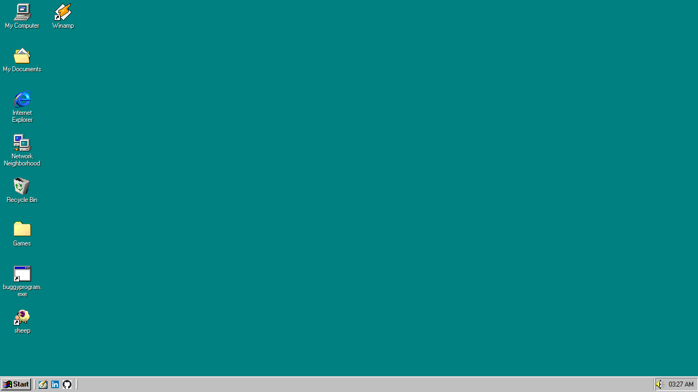
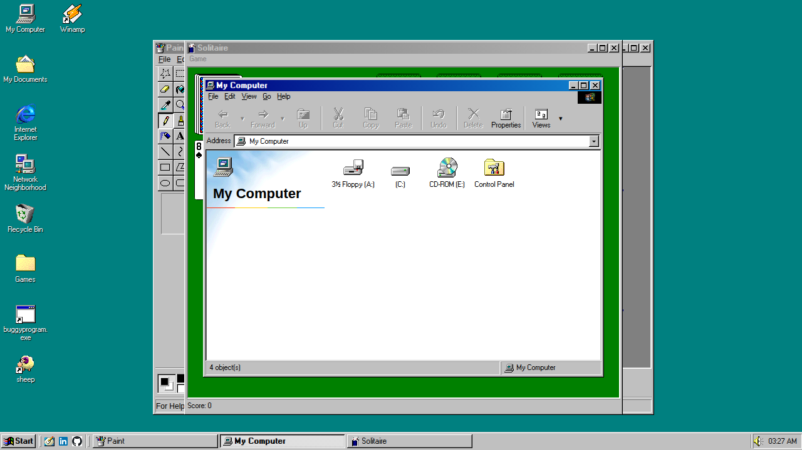

# Windows 98 Web Edition

> An ultimate pixel-perfect browser‑based recreation attempt of Windows 98.

A web-based recreation of the classic Windows 98 desktop experience, built using vanilla JavaScript, HTML, and CSS. Experience the familiar interface of Windows 98 directly in your modern browser, complete with working applications and games, customizable themes, and an AI-powered Clippy.


*Windows 98 Web Edition Desktop*

## Table of Contents

* [Live Demo](#live-demo)
* [Quick Start Guide](#quick-start-guide)
* [Background](#background)
* [What You Can Do Here](#what-you-can-do-here)
* [Applications Included](#applications-included)
* [For Developers and Tinkerers](#for-developers-and-tinkerers)
* [Architecture Overview](#architecture-overview)
* [AI Assistant](#ai-assistant)
* [Technologies Used](#technologies-used)
* [Running Locally](#running-locally)
* [Future Roadmap](#future-roadmap)
* [Assets and Credits](#assets-and-credits)

---

## Live Demo

Experience it directly in your browser:

👉 **[Windows 98 Web Edition](https://azayrahmad.github.io/win98-web/)**

*(Desktop browser recommended for the best experience. Works best on Chrome, Firefox, and Edge.)*


*Running multiple applications in Windows 98 Web Edition*

## Quick Start Guide

New to Windows 98 Web Edition? Here's how to get started:

1. **Launch the Demo**: Click the live demo link above.
2. **Open the Start Menu**: Click the **Start** button in the bottom-left corner.
3. **Try Some Apps**: Navigate to **Programs** → **Accessories** → **Games** → **Solitaire** or **Programs** → **Accessories** → **WordPad**.
4. **Explore Your Folders**: Double-click **My Computer** from Desktop and go to **File** → **Insert Removable Disk** on top left corner of the window to mount a folder from your real computer as a virtual drive. You can open and edit text files, play music & video files and also play your SWF Flash games.
4. **Browse the Retro Web**: Double-click **Internet Explorer** from Desktop and navigate to your favorite websites in 1998. Try google.com!
5. **Customize Your Desktop**: Right-click anywhere on the desktop → **Properties** to change color schemes and wallpapers. You can also go to click Start button and navigate to **Settings** → **Control Panel** → **Desktop Themes** to apply a new theme.
6. **Meet Clippy**: Launch the **Assistant** from the Start Menu (under **Programs** → **Accessories**) to activate the AI-powered Clippy. Ask about anything you want! Once running, you can find it in the system tray. 

**Pro Tips:**
* Drag windows by their title bars to move them around.
* Store your files in the **My Documents** folder for easy access.
* Right-click almost anywhere for context menus.
* Install as a PWA (look for the install icon in your browser's address bar) for a more app-like experience.
* **Mount Local Folders**: Open **My Computer**, go to **File** → **Insert Removable Disk** to mount a folder from your real computer as a virtual drive.

## Background

This project started as a small experiment to give my portfolio website a Windows 98 theme. As I explored many WebOS UI and filesystem libraries and dabbled with LLM agents like Google Jules, that experiment gradually grew into a full browser‑based desktop environment.

Over time, it became a challenge: to push how far a **vanilla JavaScript application** (no React, Vue, or Angular) could go, to explore OS‑like UI structures in the browser, and to test my ability to design and sustain a larger, long‑running personal project. It's also my opportunity to experience collaboration with LLM AI and test their limits.

**Why Windows 98?** The main inspiration for this is actually my (parents') first computer ever, a Windows 98 machine. It is my first experience with a computer, and I remember the excitement of tinkering with it. That feeling is what I'd like for you to experience as well. 

## What You Can Do Here

* Explore a browser-based desktop that behaves like a classic operating system.
* Change themes, colors, wallpapers, and sound schemes to customize your experience.
* Run classic games and utilities in an authentic retro environment.
* Create, edit, and manage files in a persistent virtual file system.
* Mount local folders and .ISO files as virtual drives (A:, D:, etc.) to work with your real files.
* Install the project as a Progressive Web App for offline access.
* Chat with an AI-powered assistant for help and nostalgia.

## Applications Included

Windows 98 Web Edition includes a growing collection of built-in applications. These range from games and media players to productivity tools and system utilities.

### Games & Entertainment
* **Windows Games**: Solitaire, FreeCell, Minesweeper, Spider Solitaire, remade from scratch. There's also Pinball Emscripten port available.
* **Classic DOS Games**: Doom, Quake, Diablo, Prince of Persia, SimCity 2000, Commander Keen (via emulation). Yes, it can play Doom.
* **Media Players**: Winamp (via Webamp), Media Player, Flash Player.

### Productivity & Accessories
* **Text Editors**: Notepad, WordPad.
* **Graphics**: Paint, Image Viewer.
* **Utilities**: Calculator, PDF Viewer.

### System Tools
* **File Explorer** with full file management and virtual drive support.
* **Task Manager** for monitoring running applications.
* **MS-DOS Command Prompt** with common DOS commands (DIR, CD, MD, DEL, COPY, etc.).
* **Display Properties & Desktop Themes** for theme and appearance customization.
* **Disk Defragmenter** (visual simulation, not real defragmentation).
* **Help & Report A Bug**.

### Special Features
* **Assistant (Clippy)**: An intelligent assistant that can answer questions and help navigate the system.

A complete and up-to-date list of applications, including development notes and how to create your own apps, is available here:

📄 **[Application Development Guide](./src/apps/README.md)**

## For Developers and Tinkerers

This project is designed to be forked, studied, and experimented with. The codebase is structured to be modular and extensible.

**Key Features for Developers:**
* Applications are registered dynamically through a central configuration system.
* Apps can be window-based (traditional GUI apps) or function-based.
* Context menus, menu bars, and keyboard shortcuts are easily configurable.
* Themes and visual styles are data-driven.
* Virtual file system with persistent storage (IndexedDB) allows for real file operations.
* Event-driven architecture with a global `window.System` API.

**Creating Your First App:**

```javascript
import { Application } from '../../system/application.js';

export class HelloWorldApp extends Application {
  static config = {
    id: 'hello-world',
    title: 'Hello World',
    width: 400,
    height: 300
  };

  _createWindow() {
    const win = new window.$Window({
      title: this.title,
      width: this.width,
      height: this.height,
    });
    win.$content.append('<div style="padding: 20px;">Hello from Windows 98!</div>');
    return win;
  }
}
```

For detailed instructions, see the **[Application Development Guide](./src/apps/README.md)**.

## Architecture Overview

### Core Components

* **System Core** (`src/system/`): Handles the fundamental "OS" logic.
  * `os-init.js`: Boot process and system initialization.
  * `window-manager.js`: Window lifecycle and z-index management.
  * `app-manager.js`: Application registration and launching.
  * `zenfs-init.js`: Virtual file system configuration.

* **Shell** (`src/shell/`): Desktop environment components (Taskbar, Start Menu, Desktop, Explorer).

* **Applications** (`src/apps/`): Individual applications decoupled from the core system.

* **Global API**:
  * `window.System.launchApp(appId, data)`: Launch applications programmatically.
  * `window.fs`: Access the virtual file system (ZenFS).
  * `window.mounts`: View currently mounted file systems.

### Virtual File System

Uses **ZenFS** to provide a Unix-like file system in the browser:

* **Root (/)**: InMemory file system, containing mount points for other drives.
* **C: Drive (/C:)**: Persistent storage (IndexedDB). Data survives browser restarts.
* **A:, D:, E:, etc.**: Can be used to mount local folders (via File System Access API) or ISO images.

## AI Assistant

Clippy is reintroduced as an optional, AI-powered assistant that provides contextual help and guidance.

**How It Works:**
* Launch the **Assistant** app from the Start Menu or Desktop.
* Type your question or request in natural language.
* Clippy processes your input using a language model backend.

**Privacy Note**: Conversations with Clippy are sent to a backend API for processing. The backend service lives here:
👉 **[resume-chat-api](https://github.com/azayrahmad/resume-chat-api)**

## Technologies Used

### Core Technologies
* **Frontend**: Vanilla JavaScript (ES6+), HTML5, and CSS3.
* **Runtime & Package Manager**: [Bun](https://bun.sh/) for lightning-fast development (Node.js/NPM no longer required).
* **Build Tool**: [Vite](https://vitejs.dev/) (optimized with Bun).
* **Virtual File System**: [ZenFS](https://zenfs.dev/) for persistent storage.

### UI & Styling
* [98.css](https://jdan.github.io/98.css/): For authentic Windows 98 styling.
* [os-gui](https://os-gui.js.org/): For core desktop GUI components (locally modified).

## Running Locally

```bash
# Clone the repository
git clone https://github.com/azayrahmad/win98-web.git
cd win98-web

# Install dependencies
bun install

# Start the development server
bun run dev
```

## Future Roadmap

* [ ] **Theme Installation**: Allow users to install custom themes (.theme/.themepack/.reg).
* [ ] **More Screensavers**: Recreate more Windows 98 Plus! screensavers.
* [ ] **Virtual Floppy**: Implement virtual floppy disk image support (create & mount).
* [ ] **WinZip**: Add WinZip to extract zip files with ZenFS Archive.
* [ ] **Migration and Backup**: Implement migrating C: drive to local folder and creating backup.
* [ ] **Testing Framework**: Expanded E2E and unit tests.
* [ ] **TypeScript Migration**: Gradual introduction of type safety.

## Assets and Credits

This project is for educational purposes. All rights to original Windows artwork, icons, and sounds belong to **Microsoft Corporation**.

For a full list of third-party libraries and resources, see **[CREDITS.md](./CREDITS.md)**.

---

<div align="center">

[Live Demo](https://azayrahmad.github.io/win98-web/) • [Report Bug](https://github.com/azayrahmad/win98-web/issues)

</div>
