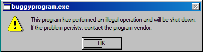

# Buggy Program

## Purpose

`buggyprogram.exe` is an intentionally "broken" application designed to simulate a common Windows error and demonstrate a "trail" effect when the window is moved. It's a playful nod to the instability sometimes associated with older operating systems.

## Key Features

- **Illegal Operation Dialog**: Mimics the classic "This program has performed an illegal operation" warning.
- **Window Trails**: As the window is moved across the desktop, it leaves a trail of static snapshots of itself, eventually "filling" the screen.
- **Recursive Launching**: Clicking "OK" or closing the window immediately launches a new instance of the program.
- **Auto-Focus**: The "OK" button is automatically focused for quick (and futile) interaction.

## How to Use

1.  Launch **buggyprogram.exe** from the desktop or Start Menu.
2.  Try to move the window around to see the trail effect.
3.  Attempt to close the program by clicking **OK** or the **Close** button; notice that it simply re-launches itself.

## Technologies Used

- **html2canvas**: Used to capture a snapshot of the application window to create the trail effect.
- **MutationObserver**: Monitors the window's `style` attribute to detect movement and trigger the drawing of trails on a background canvas.
- **System Sound Manager**: Plays the `SystemExclamation` sound on launch.

## Screenshot

