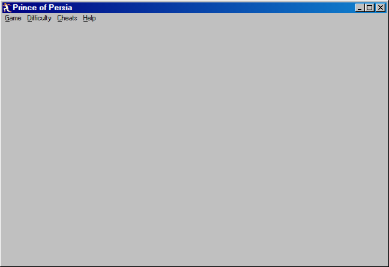

# Prince of Persia

## Purpose

Experience the original cinematic platformer, **Prince of Persia**, directly within azOS Second Edition. This application integrates a high-quality web port of the 1989 classic, allowing you to relive the adventure with modern conveniences.

## Key Features

- **Classic Gameplay**: A faithful recreation of the original game mechanics and levels.
- **Difficulty Settings**: Choose between Easy, Normal, and Hard difficulties via the application menu.
- **Cheats & Level Selection**: Skip to any level or increase your maximum health through the built-in "Cheats" menu.
- **Save/Resume**: Automatically manages game state and parameters.
- **Gamepad Support**: Supports standard gamepads for a more authentic console-like experience.

## How to Use

1.  Launch **Prince of Persia** from the desktop.
2.  Use the `Game` menu to start a **New Game** or **Restart Level**.
3.  Adjust the **Difficulty** or use **Cheats** from the menu bar if desired.
4.  **Controls**:
    -   **Arrow Keys**: Move, climb, and crouch.
    -   **Shift**: Drink potions, grab edges, and strike with your sword.
    -   **Space**: Show remaining time.

## Technologies Used

- **PrinceJS**: Utilizes the excellent `princejs.com` web port of the game.
- **IFrame Integration**: Hosted within a system window with custom menu bar controls.

## Screenshot

