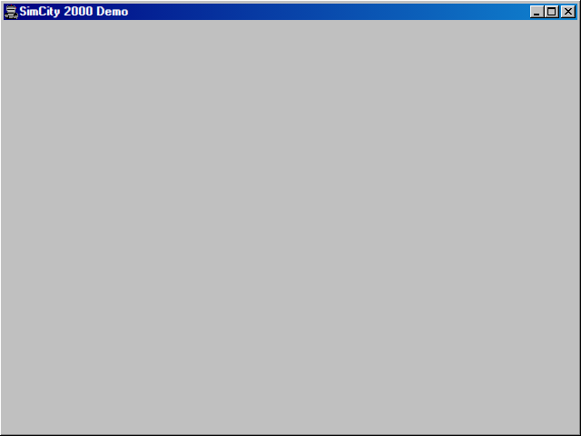

# SimCity 2000 Demo

## Purpose

Build and manage your own metropolis with the **SimCity 2000 Demo**. This application brings the classic city-building simulator to the azOS desktop, allowing you to experience the depth and complexity of the original DOS version.

## Key Features

- **Classic Simulation**: All the core mechanics of the SimCity 2000 demo.
- **DOSBox Integration**: Runs the original DOS binary using a web-based DOSBox emulator.
- **Persistence Support**: Save games and city data can be persisted (if supported by the underlying DOSBox configuration).

## How to Use

1.  Launch **SimCity 2000 Demo** from the desktop.
2.  The DOS environment will boot and launch the game automatically.
3.  Use the mouse and keyboard to navigate the game's menus and build your city.
4.  Standard DOSBox controls (like `Ctrl+F10` to capture/release the mouse) may be available depending on the emulator version.

## Technologies Used

- **DOSBox-X / JS-DOS**: The underlying emulator that provides DOS compatibility.
- **IFrameApplication**: A base class that manages the iframe lifecycle and user activity monitoring.

## Screenshot

