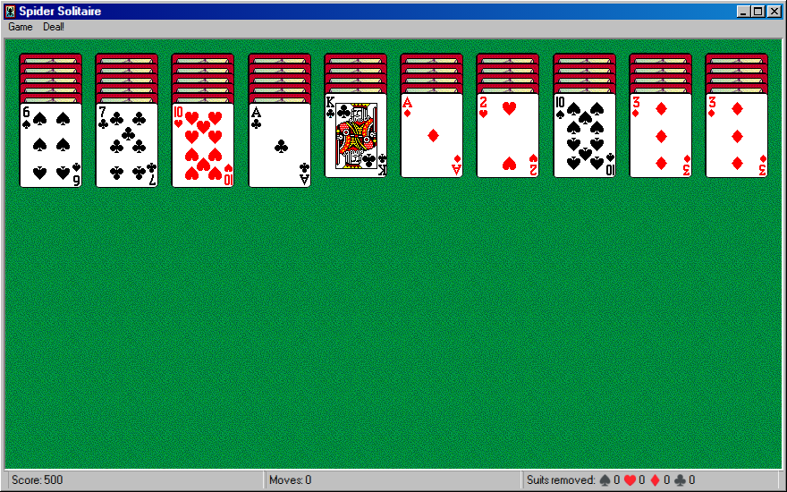

# Spider Solitaire

## Purpose

**Spider Solitaire** is a popular variation of solitaire that requires more strategy and skill. This version for azOS Second Edition provides a polished experience with multiple difficulty levels and robust statistics tracking.

## Key Features

- **Multiple Difficulties**: Play with 1 Suit (Easy), 2 Suits (Medium), or 4 Suits (Hard).
- **Statistics Tracking**: Detailed records of your wins, losses, and best times for each difficulty.
- **Save/Resume**: Automatically saves your current game so you can finish it later.
- **Hint System**: Provides suggestions if you're stuck.

## How to Use

1.  Launch **Spider Solitaire** from the Start Menu.
2.  Choose your difficulty level (number of suits).
3.  The goal is to assemble sequences of cards of the same suit in descending order (King to Ace).
4.  Once a complete sequence is formed, it is automatically moved to a foundation pile.
5.  You can move a card or a valid sequence to another column if the top card is one rank higher.

## Technologies Used

- **JavaScript/HTML/CSS**: Custom game logic and rendering.
- **ZenFS**: Used to persist game state, statistics, and options.

## Screenshot

