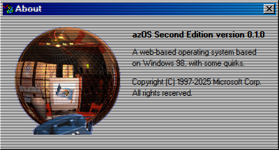

# About App

## Purpose

The **About** app is a simple utility that displays essential information about **AqualisOS**. It serves as a quick reference for users to learn about the system's identity, versioning, and legal information.

## Key Features

- **System Information**: Displays the official name and version of the operating system.
- **Copyright Notice**: Includes official copyright information for the project.
- **Physical Memory**: Shows the simulated physical memory available to the system.
- **User Information**: Displays the registered user and organization.

## How to Use

1.  Launch the application from the desktop or start menu.
2.  The "About" window will appear, displaying the system information.

## Screenshot

